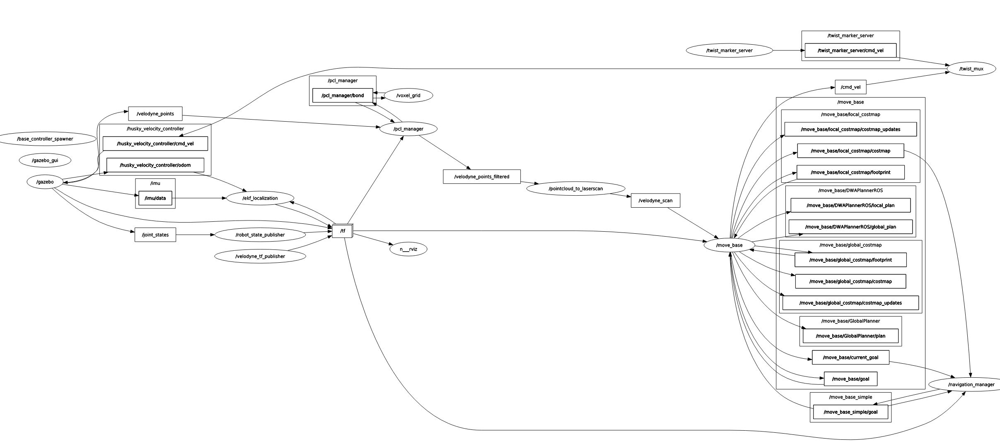

# 개요
gazebo환경에 husky와 velodyne 라이다 추가하고 dwa를 통한 장애물 회피 기동

<div align="center">
  <div style="margin-bottom: 10px;">
    
    <p style="text-align: center;">시연영상 4배속</p>
  </div>
</div>

<div align="center">
  <div style="margin-bottom: 10px;">
    
    <p style="text-align: center;">rqt_graph</p>
  </div>
</div>

# 주요 적용 사항
## husky_customization [[Link](https://github.com/husky/husky_customization)]
- husky에 HDL-32E 추가
### husky_velodyne.launch 수행내용
clearpath_playpen.world에 HDL-32E센서가 부착된 Husky A200 스폰 및 /velodyne_points 토픽 발행

## husky_dwa_navigation
- dwa_planner 패키지 사용
- pcl_manager를 이용하여 PointCluod 필터링
- config 파일 작성을 통한 각종 파라미터 최적화


# 프로젝트의 목표에 맞는 개선 사항[[PlannerSwitcher](husky_dwa_navigation/scripts/planner_switcher_node.py)]
본 알고리즘은 GPS waypoints 기반으로 주행을 염두하고 설계하였다. 그러므로 Global costmap의 역할을 없애고 목표지점까지 주행을 하는것이 목표이다. 이를 바탕으로 설계한 PlannerSwitcher는 로봇 내비게이션 시스템이 복잡한 환경이나 멀리 있는 목표지점으로 이동할 때 발생하는 문제를 해결하기 위해 설계되었습니다. 이 노드는 로컬 costmap 외부에 있는 목표를 처리하고, 경로 계획 실패 시 자동으로 대체 경로를 찾아줍니다. 핵심적으로 적용된 사항은 아래와 같다.


### 주요 기능

- **중간 목표점 자동 생성:** 로봇의 로컬 costmap 범위를 벗어난 목표를 처리하기 위해 중간 목표를 동적으로 생성
- **장애물 회피 전략:** 경로 계획 실패 시 중간 목표를 좌우로 이동시켜 장애물 우회
- **플래너 자동 전환:** 상황에 따라 적절한 내비게이션 플래너로 자동 전환
- **실패 복구 메커니즘:** 여러 번의 시도 후에도 경로를 찾지 못할 경우 대체 경로 시도

### 사용 시나리오

- 넓은 공간에서 로봇의 시야/인식 범위를 벗어난 목표로 이동할 때
- 복잡한 장애물이 있는 환경에서 기본 플래너가 경로를 찾지 못할 때
- 일반적인 내비게이션으로 접근하기 어려운 위치로 이동해야 할 때


# TODO
```
mkdir -p ~/husky_ws/src
cd husky_ws
catkin_make

cd src
git clone https://github.com/kyeonghyeon0314/gazebo_velodyne_dwa.git

sudo apt-get install ros-noetic-gazebo-ros \
                     ros-noetic-roscpp \
                     ros-noetic-sensor-msgs \
                     ros-noetic-tf \
                     ros-noetic-velodyne-gazebo-plugins \
                     ros-noetic-husky-description \
                     ros-noetic-husky-gazebo \
                     ros-noetic-dwa-local-planner \
                     ros-noetic-move-base

cd ..
catkin_make

roslaunch husky_dwa_navigation husky_velodyne_dwa.launch

```
