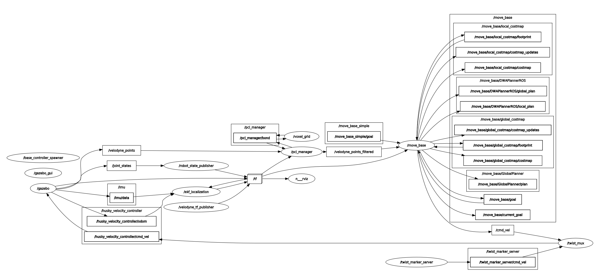

# 개요
gazebo환경에 husky와 velodyne 라이다 추가하고 dwa를 통한 장애물 회피 기동

<div align="center">
  <div style="margin-bottom: 10px;">
    
    <p style="text-align: center;">시연영상 4배속</p>
  </div>
</div>

<div align="center">
  <div style="margin-bottom: 10px;">
    
    <p style="text-align: center;">rqt_graph</p>
  </div>
</div>

# 주요 적용 사항
## husky_customization [[Link](https://github.com/husky/husky_customization)]
- husky에 HDL-32E 추가
### husky_velodyne.launch 수행내용
clearpath_playpen.world에 HDL-32E센서가 부착된 Husky A200 스폰 및 /velodyne_points 토픽 발행

## husky_dwa_navigation
- dwa_planner 패키지 사용
- pcl_manager를 이용하여 PointCluod 필터링
- config 파일 작성을 통한 각종 파라미터 최적화


# TODO
```
mkdir -p ~/husky_ws/src
cd husky_ws
catkin_make

cd src
git clone https://github.com/kyeonghyeon0314/gazebo_velodyne_dwa.git

sudo apt-get install ros-noetic-gazebo-ros \
                     ros-noetic-roscpp \
                     ros-noetic-sensor-msgs \
                     ros-noetic-tf \
                     ros-noetic-velodyne-gazebo-plugins \
                     ros-noetic-husky-description \
                     ros-noetic-husky-gazebo \
                     ros-noetic-dwa-local-planner \
                     ros-noetic-move-base

cd ..
catkin_make

roslaunch husky_dwa_navigation husky_velodyne_dwa.launch

```
