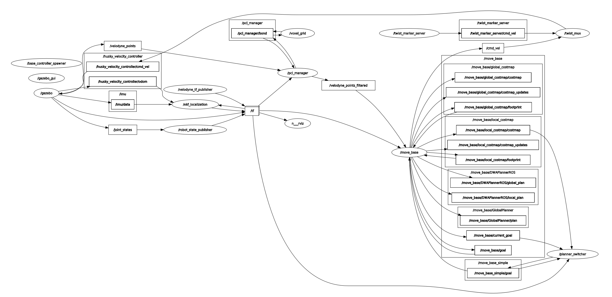

# gazebo_velodyne_dwa
gazebo환경에 husky와 velodyne 라이다 추가하고 dwa를 통한 장애물 회피 기동


<div align="center">
  <div style="margin-bottom: 10px;">
    
    <p style="text-align: center;">시연영상</p>
  </div>
</div>

<div align="center">
  <div style="margin-bottom: 10px;">
    
    <p style="text-align: center;">rqt_graph</p>
  </div>
</div>

# TODO
```
mkdir -p ~/husky_ws/src
cd husky_ws
catkin_make

cd src
git clone https://github.com/kyeonghyeon0314/gazebo_velodyne_dwa.git

sudo apt-get install ros-noetic-gazebo-ros \
                     ros-noetic-roscpp \
                     ros-noetic-sensor-msgs \
                     ros-noetic-tf \
                     ros-noetic-velodyne-gazebo-plugins \
                     ros-noetic-husky-description \
                     ros-noetic-husky-gazebo \
                     ros-noetic-dwa-local-planner \
                     ros-noetic-move-base

cd ..
catkin_make

roslaunch husky_dwa_navigation husky_velodyne_dwa.launch

```
