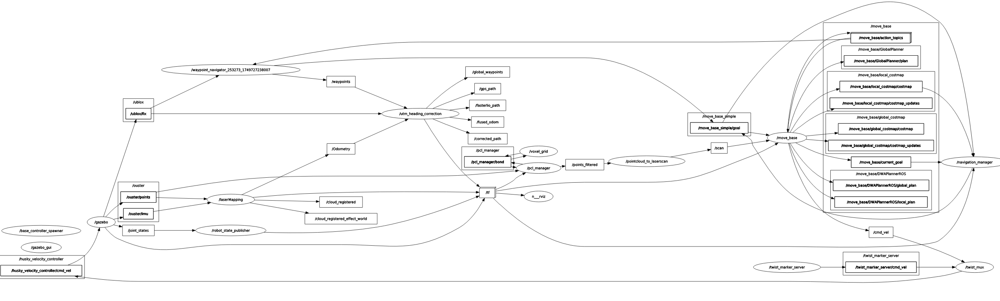

# 개요
gazebo환경에 husky와 velodyne 라이다 추가하고 dwa를 통한 장애물 회피 기동
- faster-lio와 gps를 통해 utm 좌표에 localizaiton 수행

<!-- <div align="center">
  <div style="margin-bottom: 10px;">
    
    <p style="text-align: center;">시연영상 4배속</p>
  </div>
</div>

<div align="center">
  <div style="margin-bottom: 10px;">
    
    <p style="text-align: center;">rqt_graph</p>
  </div>
</div>
<div align="center">
  <div style="margin-bottom: 10px;">
    
    <p style="text-align: center;">laserScan</p>
  </div>
</div>
<div align="center">
  <div style="margin-bottom: 10px;">
    
    <p style="text-align: center;">동적 장애물</p>
  </div>
</div> -->
<div align="center">
  <div style="margin-bottom: 10px;">
    
    <p style="text-align: center;">rqt_graph</p>
  </div>
</div>

# 주요 적용 사항
## main branch 참조 [[Link](https://github.com/kyeonghyeon0314/gazebo_dwa)]
- husky에 HDL-32E 추가
- husky_velodyne.launch 수행내용
- husky_dwa_navigation
- NavigationManager

## Faster-lio + GPS 
[팀원1](https://github.com/kdh044/global_path)의 ```path_visualizer.py```을 활용하여 제작하였습니다. 다만, 만들어두신 ```frame```의 구조는 utm->camera_init->body->base_link여서 시각화를 하는데 있어서 문제가 있었지만, 해당 구조를 아래와 같이 변경하여 진행하였습니다. 
<div align="center">
  <div style="margin-bottom: 10px;">
    
    <p style="text-align: center;">frame 구조</p>
  </div>
</div>

#### 기술적 부분
faster-lio에서 map을 생성하는 부분을 없애고 x-y평면으로 정상여하여 pose를 추출하게 변형한다. [[팀원2](https://github.com/Cascio99)분이 제작]


# TODO
```
mkdir -p ~/husky_ws/src
cd husky_ws
catkin_make

cd src
git clone https://github.com/kyeonghyeon0314/gazebo_dwa.git -b gps_localization

# 필수 의존성 설치
sudo apt-get install ros-noetic-gazebo-ros \
                     ros-noetic-roscpp \
                     ros-noetic-rospy \
                     ros-noetic-sensor-msgs \
                     ros-noetic-std-msgs \
                     ros-noetic-geometry-msgs \
                     ros-noetic-nav-msgs \
                     ros-noetic-tf \
                     ros-noetic-tf2-ros \
                     ros-noetic-tf2-geometry-msgs \
                     ros-noetic-velodyne-description \
                     ros-noetic-velodyne-gazebo-plugins \
                     ros-noetic-husky-description \
                     ros-noetic-husky-gazebo \
                     ros-noetic-husky-control \
                     ros-noetic-dwa-local-planner \
                     ros-noetic-global-planner \
                     ros-noetic-move-base \
                     ros-noetic-pcl-ros \
                     ros-noetic-nodelet \
                     ros-noetic-pointcloud-to-laserscan \
                     ros-noetic-costmap-2d \
                     ros-noetic-dynamic-reconfigure \
                     ros-noetic-urdf \
                     ros-noetic-xacro
pip install utm

cd ..
catkin_make

# 시뮬레이션 및 로봇 스폰
roslaunch husky_dwa_navigation husky_gazebo_spawn.launch

# dwa및 localization
roslaunch husky_dwa_navigation husky_control_nav_localization.launch
```
